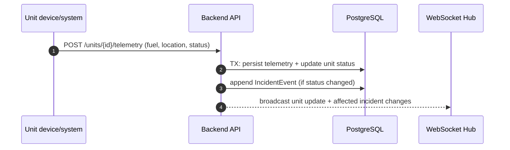
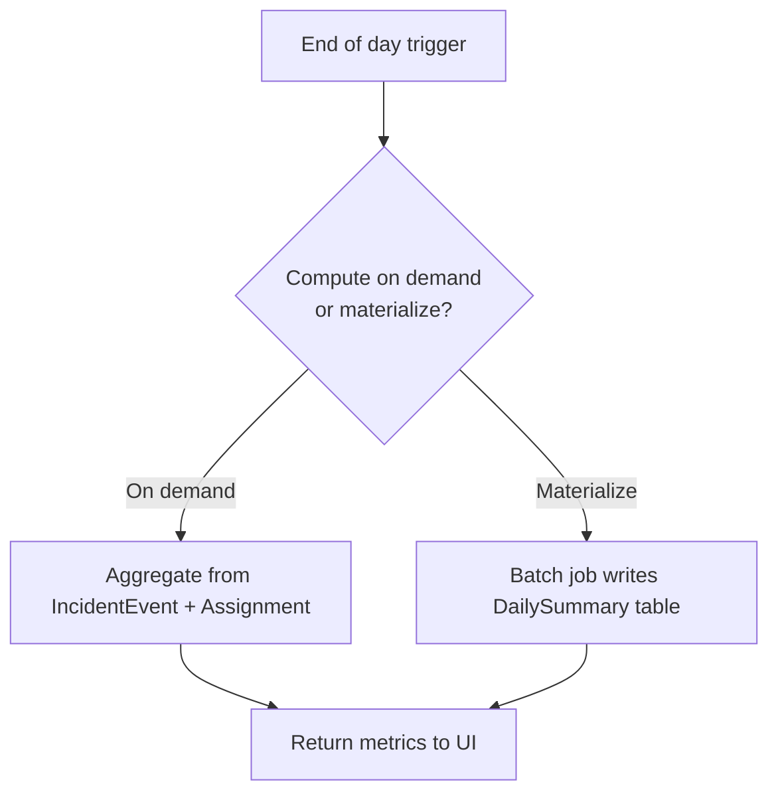

## Flowcharts (key workflows)

## 1) Emergency intake → allocation → dispatch

```mermaid
flowchart TD
  A[Operator creates Emergency Log] --> B[Validate details\nlocation, severity, type, ETA]
  B --> C[Build incident summary]
  C --> D{Confirm log?}
  D -- No --> A
  D -- Yes --> E[Persist Emergency + Incident\nstatus=LOGGED]
  E --> F[Compute priority score]
  F --> G[Availability check\nby time + location + status]
  G --> H[AllocationStrategy returns\nProposed Assignments]
  H --> I[UI shows proposal\nand unit states]
  I --> J{Operator adjusts?}
  J -- Yes --> K[Recalculate + validate\n(no double-booking)]
  K --> I
  J -- No --> L[Confirm dispatch]
  L --> M[Transactional commit:\nDispatch + Assignments\nIncident status=DISPATCHED]
  M --> N[Publish realtime update\n(WebSocket)]
  N --> O[Units update status\nenroute/onscene]
```

## 2) Resource telemetry/status update



## 3) End-of-day summary



